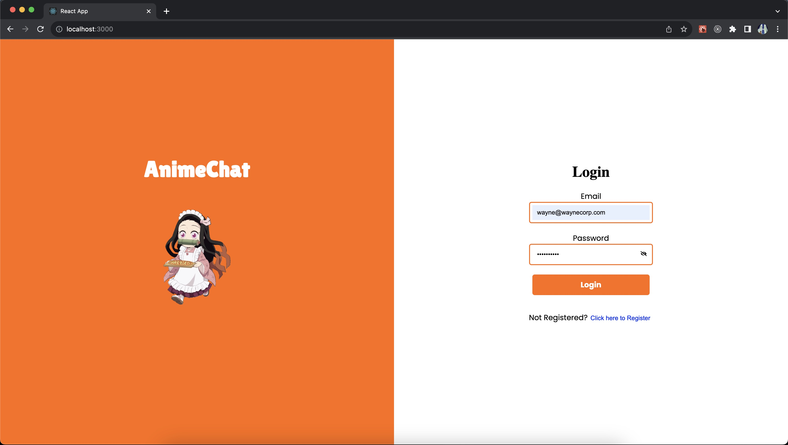
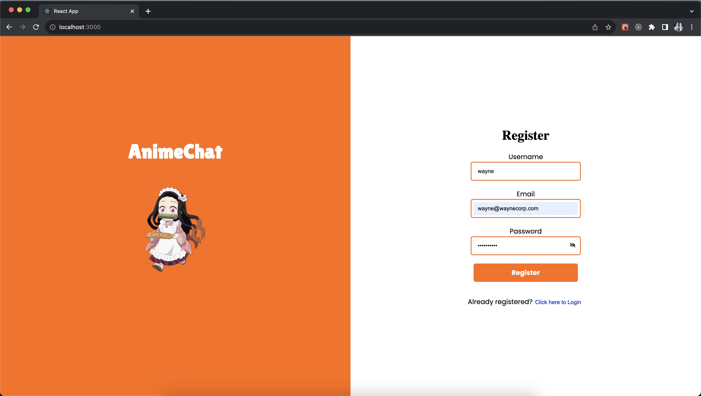

# CS5610 Su23 Project Frontend

App name: AnimeChat

App Summary:

A platform where users can chat about their favorite Anime. Each Anime has its dedicated channel where users can post their thoughts and be involved in discussions with others who are online. 

App link: https://animechat-frontend-shashankbs.uw.r.appspot.com

## Iter3:

This is the final iteration of the app. I have build a group chat application where users can talk about their favorite animes. 

### Contribution:

Total contribution as I am the only group member.

### Progress

For this iteration, I have developed most of the UI. In Iteration 2, I worked on the backend. Hence, this iteration was all about completing the remaining UI.

The features that I have covered in this Iteration are:

a. Add message to a group
b. Delete messages only sent out by you
c. Switch bewteen groups
d. Authentication with Google (I moved away from the registration and sign in pages as I was short of time. But I'll try improving this app even after the course ends!)

### Progress

For this iteration, I have developed the login/registration screen of the application.

The Login/Registration page contains:
a. App name
b. App Icon - In this case an Anime character
c. A Login Form
d. A Registration Form

## Iter1:

### Contribution:

As I am the sole member of this group, the entire contribution towards the app's development is mine.

### Progress

For this iteration, I have developed the login/registration screen of the application.

The Login/Registration page contains:
a. App name
b. App Icon - In this case an Anime character
c. A Login Form
d. A Registration Form

To handle the form validation, I have made use of a React 3rd party library called 'Formik'. Using this library has made handling form validation very easy and shortened the amount of code I had to write. 

On the same page the user can switch between the login and registration forms:

Login form:

Registration form:

