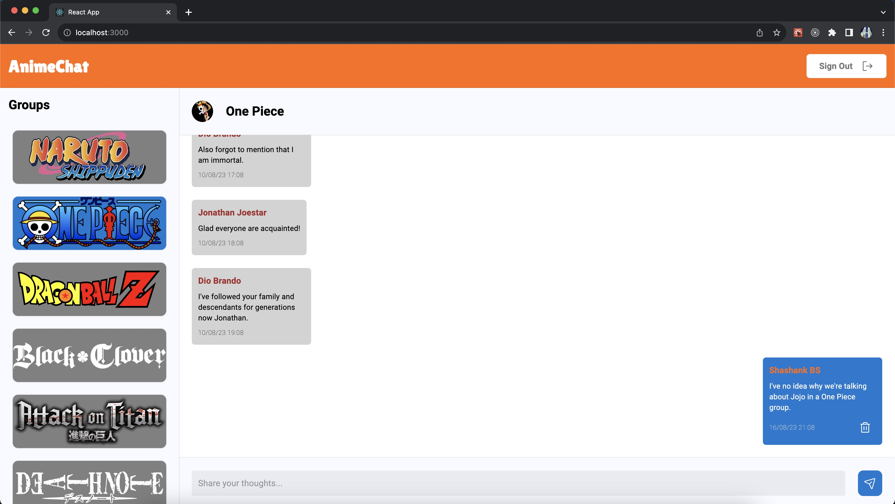

# AnimeChat

App name: AnimeChat

App Summary:

A platform where users can chat about their favorite Anime. Each Anime has its dedicated channel where users can post their thoughts and be involved in discussions with others who are online. 

### Features

* Sign In with Google
* Switch between different anime chat groups
* Does not let user post message when not logged in
* Active group is highlighted in blue
* Post your message to a group
* Delete messages only sent out by you

### Screenshots:

Login page:

Group with no messages:

Group with messages:

